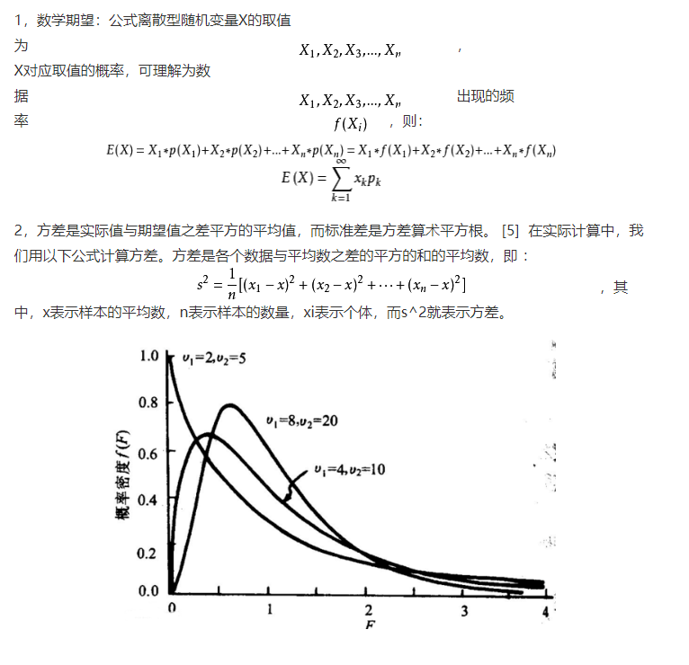

# 论文架构

## 论文架构

```java

* 1. 绪论
** 1.1 研究背景
** 1.2 研究现状
** 1.3 研究内容
** 1.4 论文组织结构

* 2. 相关理论与技术概述
** 2.1 用到的技术简介 -- golang,threejs,mongo
** 2.2 用到的理论简介 -- 克里金，蚂蚁算法，计算机图形学，空间坐标计算
** 2.3 本章小结

* 3. 需求分析
** 3.1 系统建设目标
** 3.2 功能需求分析
*** 3.2.1 地表模型生成
*** 3.2.2 地表切线绘制
*** 3.2.3 地表最短路径寻优
*** 3.2.4 管线数据统计汇总
** 本章小结

* 4. 设计与实现
** 4.1 系统架构设计
** 4.2 数据库设计
** 4.3 系统关键技术与算法
*** 4.3.1 地表克里金插值
*** 4.3.2 三维空间切线
*** 4.3.3 三维空间最短路径
** 4.4 地表插值模块
** 4.5 地表切线模块
** 4.6 地表最短路径寻优模块
** 4.7 管线数据统计模块
** 4.8 本章小结

* 5. 总结与展望
** 5.1 总结
** 5.2 展望

```
### 地表插值模块

1. 克里金插值法和距离反比加权法比较
   1. 空间插值问题，就是在已知空间上若干离散点  的某一属性(如气温，海拔)的观测值  的条件下，估计空间上任意一点 的属性值的问题。 
   2. 地理属性有空间相关性，相近的事物会更相似。由此人们发明了反距离插值，对于空间上任意一点的属性 ，定义反距离插值公式估计量
2. 克里金插值
   1. [克里金插值法](https://xg1990.com/blog/archives/222#comment-2364)
3. 克里金插值步骤
   1. 对于观测数据，两两计算距离与半方差 
   2. 寻找一个拟合曲线拟合距离与半方差的关系，从而能根据任意距离计算出相应的半方差 
   3. 计算出所有已知点之间的半方差 r i j rij 
   4. 对于未知点 z o zo，计算它到所有已知点 z i zi的半方差 r i o rio 求解第四节中的方程组，得到最优系数 λ i λi 
   5. 使用最优系数对已知点的属性值进行加权求和，得到未知点 z o zo的估计值

### 地表切线模块

#### 钻孔与地表交点获取

1. 从数据库中导入钻孔的二维坐标
2. 获取钻孔的三维坐标
   1. 从数据库中获取插值地表数据
   2. 快速空间射线，三角形求交法（谦谦论文），利用 three.js 中 raycaster 原理（three.js 原理）

#### 切线获取

1. 专利内容
2. 先投影到二维平面
3. 对符合范围内的三角形求交点
4. 根据三角形每条边的直线方程获取 z 值

### 地表最短路寻优模块

> 重点模块

1. 两点之间最短路
   1.  
2. 定点之间最短路

### 管线数据统计模块

## 数学知识回顾

1. 期望和平均值的主要区别是：期望主要是针对大群体数据的计算，平均值主要针对小群体的计算。
2. 期望大样本的平均值
3. 如果想知道一组数据之间的分散程度的话就可以使用方差来表示
4. 方差是在概率论和统计方差衡量随机变量或一组数据时的离散程度的度量，换句化说如果想知道一组数据之间的分散程度的话就可以使用方差来表示



## 算法论文参考

```xml
* 1. 绪论
** 1.1 研究背景
** 1.2 研究内容
** 1.3 研究定位（在实验室研究框架中的位置）
** 1.4 研究框架
** 1.5 章节结构

* 2. 相关研究
** 2.1 因控/风险计算/情报分析---场景梳理
** 2.2 因控/风险计算/情报分析---方法相关研究
** 2.3 因控/风险计算/情报分析---数据梳理
** 2.4 算法1 问题相关方法
** 2.5 算法2 问题相关方法
** 2.6 本章小结

* 3. 算法abc
** 3.1 问题定义
** 3.2 方法定义
** 3.3 评价指标若干
** 3.4 公开数据集描述
** 3.5 实验
** 3.6 实验结果
** 3.7 结果分析
** 3.8 本章小结

* 4. 算法2-AAABB
** 4.1 问题定义
** 4.2 方法定义
** 4.3 评价指标若干
** 4.4 公开数据集描述
** 4.5 实验
** 4.6 实验结果
** 4.7 结果分析
** 4.8 本章小结

* 5. case study
** 5.1 数据集描述
** 5.2 数据准备(数据结构，-->数据结构)
** 5.3 实证过程
** 5.4 实证结果
** 5.5 结果分析
** 5.6 本章小结

* 6. 总结与展望
** 6.1 总结
** 6.2 展望
------根据你的自己想法与指导老师的意见 更新二级目录 

1. 十级脉络，  ---请修订到10级，目前只有部分达到
2. 研究框架图，-----用PPT做，放在PPT中
3. 每一个二级目录的图或表发我-----用PPT做，放在PPT中
4. 其他的内容更新在你的毕业设计wiki--------你还未更新，请更新！
5. 找指导老师讨论你的东东
```